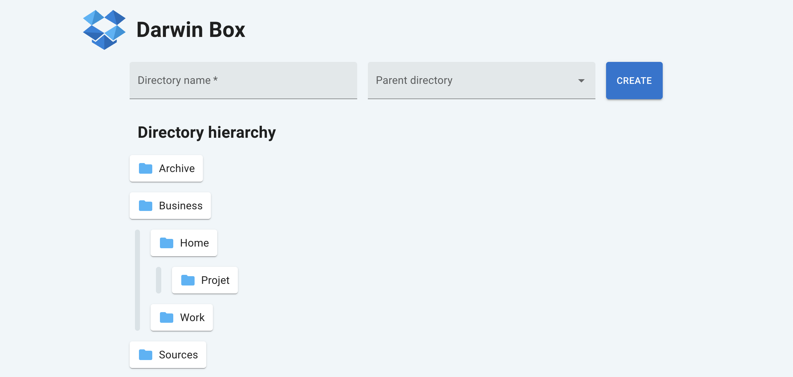

# DarwinBox

DarwinBox is a Dropbox-like directory management system.

This system allows you to create, rename, delete, and list directories with infinite nesting and real-time updates.

## Local deployment

Use Docker Compose to run the app locally.

```shell
docker compose up -d
```

Before using the app, you must create the database in PostgreSQL.

```shell
docker compose exec database psql -U postgres -c "CREATE DATABASE darwin_box;"
```

And run all the database migrations to finish its configuration.

```shell
docker compose exec back /app/sqlx migrate run --source /app/migrations
```

The app is fully functional and running on http://localhost:7777.

## Global Design

The design thrives for simplicity.

DarwinBox is composed of several services :

- Database (PostgreSQL)
- Backend in Rust (REST API and Websocket)
- Frontend in Typescript (Single Page Application serve by a Caddy server)
- Reverse-Proxy (Caddy)

We have got a two tier architecture (data and web) with an API mostly stateless.
The state of the frontend is handled by a reducer in order to separate the state from the view.

Users first fetch the directory hierarchy using the REST API and subscribe to changes in the directory structure using websocket for real time update.

Users can :
- create new directory with a name and optionally a parent directory
- rename an existing directory
- delete an existing directory and all its subdirectory recursively.

All updates are distributed to the other users using websocket and PostgreSQL LISTEN/NOTIFY.

The services are containerised for simple deployment.

Linter, formatter and tests ensure code quality for Rust and Typescript code base.


## REST API

| __Method__ | __Endpoint__ | __Description__ |
|-|-|-|
| __GET__ | `/api/directories` | Retrieves all directories and subdirectories. |
| __POST__ | `/api/directories` | Create a new directory. |
| __GET__ | `/api/directories/:directory_id` | Retrieves a directory and all its subdirectories. |
| __PUT__ | `/api/directories/:directory_id` | Update directory name. |
| __DELETE__ | `/api/directories/:directory_id` | Deletes a directory and all its subdirectories. |

## Websocket

Users receive changes from the server. The payload sent by the websocket server is the following.

```rust
#[derive(Debug, Clone, Deserialize, Serialize)]
struct Payload {
    action: ActionPayload,
    id: i32,
    name: String,
    parent_id: Option<i32>,
}

#[derive(Debug, Clone, Deserialize, Serialize)]
#[serde(rename_all = "UPPERCASE")]
enum ActionPayload {
    Update,
    Delete,
    Insert,
}
```

The browser then updates its local state to reflect the change.

## Production deployment

To deploy this app in production, you can:
- update the reverse-proxy Caddy configuration and use Docker Compose on a VPS
- or use managed service for PostgreSQL database and deploy containers in a PaaS

Each one of the services can be deployed on its own machine and communicate with the other services using network calls.

## Performance issues

### Horizontally scale the Rust Backend

The Rust Backend is not truly stateless.
It uses WebSocket.
To change that, the first step should be to split the backend in half:
One side with the stateless REST API that we could horizontally scale,
And the other side with the stateful WebSocket server that we could horizontally scale, but with extra care.
In order for the load balancer to always route a user to the same WebSocket server, we must use an HTTP header.

### Use a CDN for static assets

We could move static assets (JS, CSS, fonts) to a CDN for better performance.

### Use a cache for directory hierarchy

To prevent the costly SQL recursive query, we could cache the directory hierarchy.
It will speed up the initial query that users make in order to initialize their browser's state.

### Use a message queue instead of PostgreSQL to handle change event

Instead of using PostgreSQL LISTEN/NOTIFY, we could use a message queue.
Each REST API call will send a message containing the change to the message queue.
WebSocket servers would listen for changes and send them to other users.
A new worker service would also listen for changes and update the directory hierarchy structure in the cache.

## Consistency issues

The current design has consistency issues.
Between the first initial fetch used to retrieve the browser's initial state and the time the WebSocket connection is ready, other users may have made changes that will not be reflected in the user's browser state. The user may have missed some events. If the app gets a lot of users, these situations will be more common.

A solution we could use is to implement a monotonic counter for the events.
When the browser fetches the initial state, it gets the latest counter value.
Each time there is a change, the counter is incremented.
Once the WebSocket connection is ready, the client gives its counter value to the server.
The WebSocket will send all the events that have a greater counter than the one given by the user.
Thus the user will not miss any events.

## Future works

- Improve server errors for a better UX.
- Add i18n support.
- Improve the UX of the parent directory picker when two folders have the same name.
- Add more tests and end-to-end tests using puppeteer.
